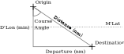

Plane Sailing
====================

Plane Sailing is so called because we pretend the Earth is flat for the purpose of the calculation. Because of this, Plane Sailing is only accurate enough for distances under 500 nautical miles. It is necessary to have an understanding of the trigonometry rules for Right Angle Triangles (https://courses.lumenlearning.com/boundless-algebra/chapter/trigonometry-and-right-triangles/), so brush up on that if you're not familiar before carrying on.

The Concept
---------------
We construct a right angled triangle using the D'Lon in minutes, and the Departure. In order to calculate the Departure we need a Latitude, so we use the mean (average) of the Origin and Destination Latitude, referred to as M'Lat. Our Right Angle triangle ends up looking like this, we always draw a line South or North from the Origin first, and then go East or West to the Destination.

In order to solve the triangle and get our distance we follow these steps:

1. Calculate the D'Lon and D'Lat between the two points.
2. Calculate the Mean latitude (M'Lat) between the two latitudes.
3. Calculate the Departure using :math:`D'Lon_{min} * cos M'Lat`.
4. Using the tangent right triangle rule, calculate the Course Angle: :math:`\tan^{-1 }(Departure_{nm} \div D'Lon_{min})`.
5. Using the cosine right triangle rule, calculate the Distance: :math:`D'Lat_{min} \div \cos \text{Course Angle}`

.. raw:: html

    

    

Next up we have :doc:`./mercator_sailing`.
